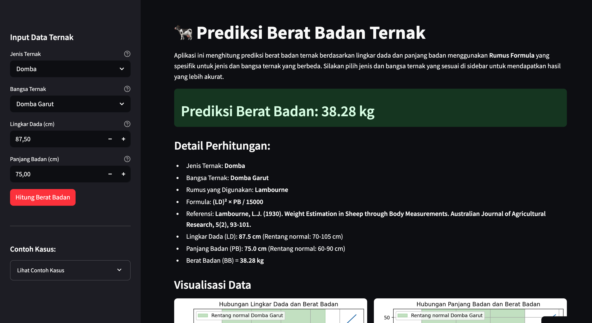

# 🐄 BBTernak - Aplikasi Prediksi Berat Badan Ternak

BBTernak adalah aplikasi berbasis web yang dibangun dengan Streamlit untuk membantu peternak memprediksi berat badan ternak (sapi, kambing, dan domba) tanpa memerlukan timbangan. Aplikasi ini menggunakan rumus-rumus formula yang telah divalidasi secara ilmiah berdasarkan lingkar dada dan panjang badan ternak.



## 📋 Fitur Utama

- Prediksi berat badan untuk 3 jenis ternak (Sapi, Kambing, Domba)
- Mendukung berbagai bangsa ternak dengan faktor koreksi spesifik
- Visualisasi hubungan antara lingkar dada, panjang badan, dan berat badan
- Penjelasan detail tentang rumus-rumus yang digunakan
- Informasi tentang cara pengukuran yang benar
- Tabel prediksi dengan variasi ukuran untuk analisis sensitivitas

## 🔧 Cara Penggunaan

1. Pilih jenis ternak (Sapi, Kambing, atau Domba)
2. Pilih bangsa ternak spesifik
3. Masukkan lingkar dada ternak (cm)
4. Masukkan panjang badan ternak (cm)
5. Klik tombol "Hitung Berat Badan"
6. Lihat hasil prediksi berat badan beserta detail perhitungan dan visualisasinya

## 📊 Rumus yang Digunakan

### Sapi
- **Winter (Eropa)**: (LD)² × PB / 10815.15
- **Schoorl (Indonesia)**: (LD + 22)² / 100
- **Denmark**: (LD)² × 0.000138 × PB
- **Lambourne (Sapi Kecil)**: (LD)² × PB / 11900

### Kambing
- **Arjodarmoko**: (LD)² × PB / 18000
- **New Zealand**: 0.0000968 × (LD)² × PB
- **Khan**: 0.0004 × (LD)² × 0.6 × PB

### Domba
- **Lambourne**: (LD)² × PB / 15000
- **NSA Australia**: (0.0000627 × LD × PB) - 3.91
- **Valdez**: 0.0003 × (LD)² × PB

## 📐 Cara Pengukuran yang Benar

### Lingkar Dada (LD)
- Melingkarkan pita ukur pada bagian dada tepat di belakang sendi bahu (scapula)
- Pastikan ternak berdiri dengan posisi normal
- Tarik pita dengan kekencangan sedang

### Panjang Badan (PB)
- **Sapi**: Dari tonjolan bahu sampai tonjolan tulang duduk
- **Kambing/Domba**: Dari sendi bahu sampai tonjolan tulang duduk

## 💻 Instalasi dan Menjalankan Aplikasi

### Prasyarat
- Python 3.7+
- pip

### Langkah Instalasi

1. Clone repository ini:
   ```
   git clone https://github.com/adiorany3/bbternak.git
   cd bbternak
   ```

2. Buat virtual environment (opsional tapi direkomendasikan):
   ```
   python -m venv venv
   source venv/bin/activate  # Untuk Linux/Mac
   venv\Scripts\activate     # Untuk Windows
   ```

3. Install dependencies:
   ```
   pip install -r requirements.txt
   ```

4. Jalankan aplikasi:
   ```
   streamlit run sapi_weight_predictor.py
   ```

5. Buka browser dan kunjungi `http://localhost:8501`

## 📱 Kompatibilitas

Aplikasi dapat dijalankan pada:
- Desktop (Windows, macOS, Linux)
- Mobile (melalui browser)
- Tablet (melalui browser)

## 🧪 Keterbatasan dan Pertimbangan

- Rumus-rumus prediksi memberikan estimasi, bukan nilai eksak
- Faktor kondisi tubuh ternak (terlalu kurus/gemuk) dapat mempengaruhi akurasi
- Untuk keperluan yang memerlukan presisi tinggi, sebaiknya tetap menggunakan timbangan

## 📚 Referensi

- Winter, A.W. (1910). Method for estimating live weight in cattle.
- Schoorl, P. (1956). Live weight estimation methods for local Indonesian cattle.
- Lambourne, L.J. (1963). A method of estimating the live weight of small ruminants.
- Arjodarmoko, S. (1975). Pendugaan bobot badan kambing lokal Indonesia.

## 📄 Lisensi

© 2025 Galuh Adi Insani - Hak Cipta Dilindungi

## 🧑‍💻 Tentang Pengembang

Aplikasi ini dikembangkan oleh Galuh Adi Insani dengan fokus pada pembuatan alat praktis untuk membantu peternak kecil dan menengah di Indonesia.